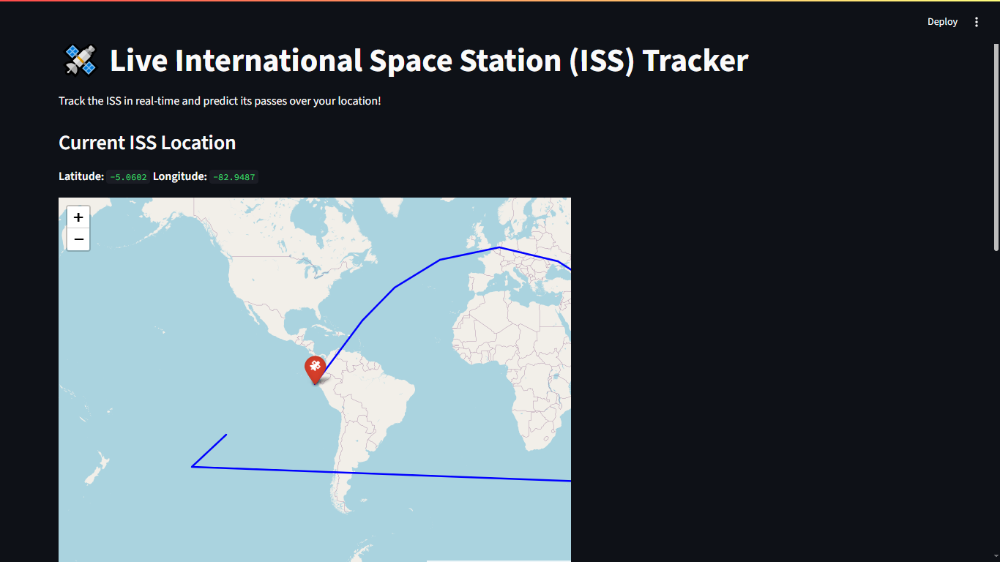
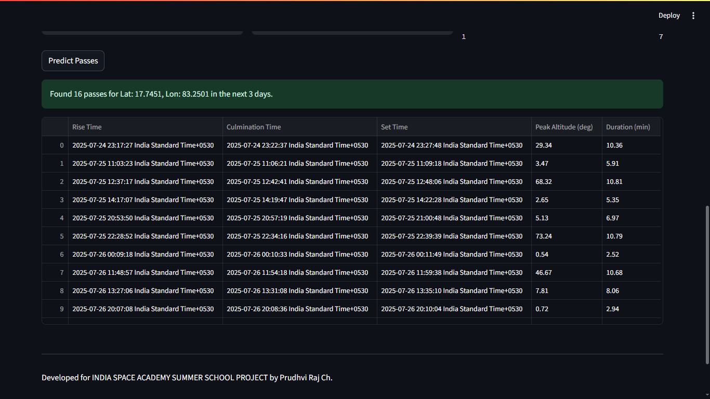

# 🛰️ ISS Live Tracker

This is a **Streamlit web app** that tracks the **International Space Station (ISS)** in real-time and predicts its future passes over any location on Earth.

Developed as part of the **India Space Academy Summer School Project** by **Prudhvi Raj Ch.**

---

## 🚀 Features

- Real-time ISS position with mapping via **Folium**
- Ground track for the next 90 minutes
- ISS pass prediction over a user-defined location
- Built using:
  - `streamlit`
  - `skyfield`
  - `folium`
  - `pandas` and `numpy`

---

## 📷 Screenshots




---

## 🔧 How to Run Locally

### 1. Clone the repository
```bash
git clone https://github.com/PrudhviRajChitturi/ISS-tracker-webapp-using-streamlit
cd iss-live-tracker
```
---

## **This is an open source project**
